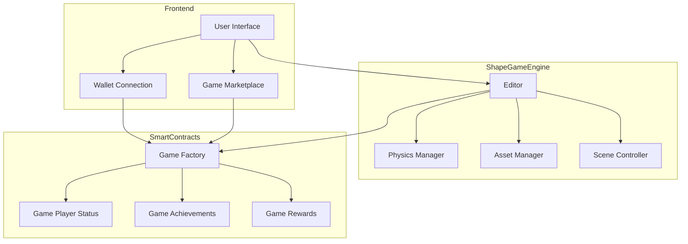

# ShapeGameCrafter: Build & Deploy Games on Shape Blockchain

> Empowering developers to create, deploy, and monetize blockchain games with ease

## 🎮 Overview

ShapeGameCrafter is a comprehensive game development platform that enables developers to build and deploy blockchain games on the Shape Network. It combines the power of Web3 technology with intuitive game development tools to create immersive gaming experiences.

## 🎯 Problem Statement

Traditional game development platforms face several challenges:
- Complex blockchain integration
- Limited monetization options
- Difficult asset management
- Poor player engagement tracking
- Centralized control and ownership

## 💡 Solution

ShapeGameCrafter provides an end-to-end solution that addresses these challenges through:
- Seamless blockchain integration
- Built-in NFT support
- Decentralized asset management
- On-chain achievement system
- Player-owned economy

## 🏗 Architecture

## 🔄 User Flow

### Game Developer Flow

1. **Game Creation**
   - Connect wallet to ShapeGameCrafter platform
   - Access the Game Engine interface
   - Create game scenes using the visual editor
   - Add 3D models, lights, and physics properties
   - Define game objectives and achievements
   - Test game mechanics in preview mode

2. **Asset Management**
   - Upload 3D models and textures to IPFS
   - Manage game assets through Asset Manager
   - Set up collision detection and physics properties
   - Configure lighting and environmental settings

3. **Game Deployment**
   - Deploy game to Shape Network through Game Factory contract
   - Set game parameters (price, rewards, achievements)
   - Configure player progression system
   - Publish to marketplace

### Player Flow

1. **Game Discovery**
   - Browse games in marketplace
   - View game details and requirements
   - Check achievement system and rewards

2. **Game Purchase & Play**
   - Connect Web3 wallet
   - Purchase game access (if required)
   - Download/access game client
   - Start playing with wallet-linked identity

3. **Progression & Rewards**
   - Complete in-game tasks
   - Earn achievements
   - Collect NFT rewards
   - Track progress on-chain

## 🔧 Technical Components

### Frontend (`/frontend`)
- Next.js-based web application
- Web3 wallet integration (MetaMask, WalletConnect)
- Game marketplace interface
- Player dashboard
- Achievement tracking

### Shape Game Engine (`/shape-game-engine`)
- React Three Fiber for 3D rendering
- Physics engine integration
- Visual scene editor
- Asset management system
- Real-time preview
- Task and achievement configuration

### Smart Contracts (`/smartcontract`)
- Game Factory: Deploys new game instances
- Game Contract: Manages game state and access
- Player Status: Tracks player progress
- Achievement System: Manages rewards and accomplishments

## 💡 Key Features

### For Developers
- **Visual Editor**: Drag-and-drop game creation
- **Asset Management**: Easy 3D model and texture handling
- **Smart Contract Integration**: Built-in Web3 functionality
- **Achievement System**: Configurable reward mechanics
- **Testing Tools**: Preview and debug capabilities

### For Players
- **Web3 Integration**: Seamless wallet connection
- **Cross-Game Assets**: NFT support across games
- **Achievement System**: On-chain progress tracking
- **Reward System**: Earn NFTs and tokens
- **Player Profile**: Persistent game progress

## 🔗 Shape Network Integration

- Native NFT support for game assets
- Low-cost transactions for game actions
- High-performance blockchain for game state
- Cross-chain compatibility
- Secure smart contract deployment
- Scalable infrastructure

## 🔧 Components

### Frontend (`/frontend`)
- React-based user interface
- Web3 wallet integration
- Game marketplace
- Asset management interface
- Achievement tracking
- Player rewards system

### Shape Game Engine (`/shape-game-engine`)
- 3D game development environment
- Physics engine integration
- Asset import/export
- Scene management
- Game logic editor
- Real-time preview

### Smart Contracts (`/smartcontract`)
- Game deployment contracts
- Player status tracking
- Achievement system
- NFT reward mechanism
- Token management

## ⭐ Features

### For Developers
- Drag-and-drop game editor
- Built-in physics engine
- Asset management system
- Smart contract integration
- Monetization tools
- Achievement system creation

### For Players
- Web3 wallet integration
- NFT ownership
- Achievement tracking
- Cross-game assets
- Player rewards
- Community features

## 🔗 ShapeGameCrafter Integration

ShapeGameCrafter leverages Shape Blockchain's unique features:
- High-performance transactions
- Low gas fees
- Native NFT support
- Cross-chain compatibility
- Secure smart contracts
- Scalable infrastructure

## 🚀 Getting Started

1. Clone the repository
2. Install dependencies
3. Configure environment variables
4. Start development server
5. Deploy smart contracts
6. Begin building your game!

## 📚 Documentation

Detailed documentation for each component can be found in their respective directories:
- [Frontend Documentation](/frontend/README.md)
- [Game Engine Documentation](/shape-game-engine/README.md)
- [Smart Contracts Documentation](/smartcontract/README.md)

## 🤝 Contributing

We welcome contributions! Please read our contributing guidelines and submit pull requests.

## 📄 License

This project is licensed under the MIT License - see the LICENSE file for details.